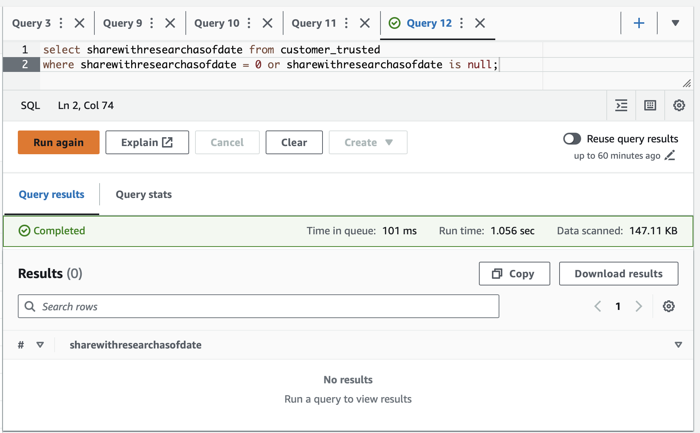

# STEDI Human Balance Analytics

All glue ETL scripts are in `scripts` folder.
All SQL create commands are in `sql` folder.

## Landing Zone

### Customer landing zone:

### Accelerometer landing zone:

### Step trainer landing zone:

## Trusted Zone

### Customer trusted zone:

### Accelerometer trusted zone:

### Step trainer trusted zone:

## Curated Zone

### Customer curated zone:

### Machine learning curated zone:

